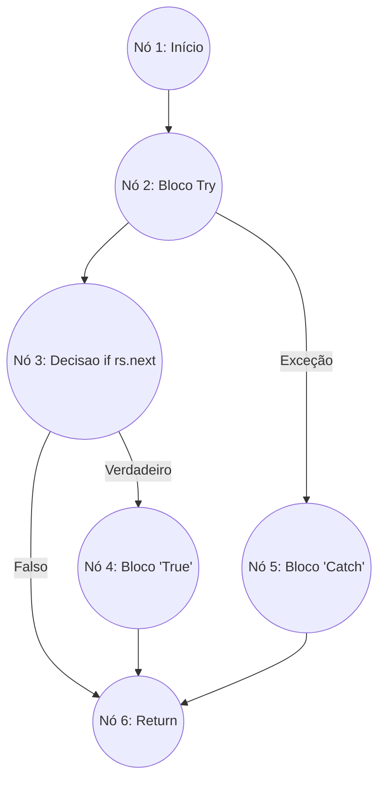

Teste Caixa Branca

 Grafo De Fluxo

V(G) = 3 REGIÕES.

V(G) = 7 ARESTAS.

V(G) = 6 NÓS.

CÁLCULO : V(G) = 7 - 6 = 1 + 2 = 3

Caminho 1 = 1; 2; 3; 4; 6; 

Caminho 2 = 1; 2; 3; 6;

Caminho 3 = 1; 2; 5; 6;